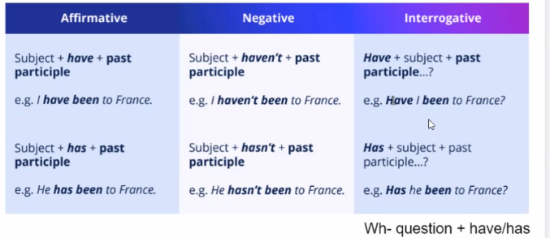

# present perfect
> how to form: hava/has + past participle
## present perfect simple
> focus on the result, is a permanent thing?这个不懂
- they have eaten the pizza  
auxiliary verb + main verb in past participle form
- we've written an essay about climate change
---
when use present perfect we do not give a specific finish time
- connection to the present
  - i've lived in New York for 1 year
- past experiences() 
  - I've been to French twice.(~~in 2015 and 2016~~ - > that's not right,the finished time use for past simple)
  - I've met the pope.(~~in july~~, the finished time use for past simple)
- unfinished time
  - I've written over 10 emails today
## present perfect continuous
> focus on the activity, still doing on it, not finished yet, action is a more temporary thing(也不懂)
- they have been eating the pizza

---
lingoda老师的问题
how long have you lived in your current house.
I have lived in my current house for a year.

---
the verb 3 form
infinitive eat  
past simple ate
past participle eaten