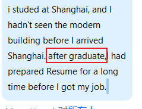

i studed at Shanghai, and I hadn't seen the modern building before I arrived Shanghai.
after graduate,I had prepared Resume for a long time before I got my job.

After,before, without—preposition   
After eating, we went out

i gave up smoking.

after preposition plus ing

perfect english grammar