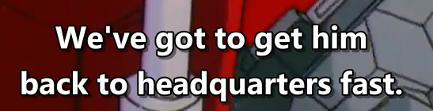

# s1e4

# we've got to get him

have got to 和have to 都是必须去做某事的意思    
have got to 更倾向于表达我现在就要去完成这个事情  
have to 更倾向于表达我必须完成这个事情

一个强调我需要立刻行动，一个强调这个事情的必要性

# backtalk

"pull through" 在这句话中的意思是指某人渡过困境、克服困难、恢复健康或成功度过某种情况。

# got away

在这里，"got away" 是一个常用的短语，表示成功逃脱、摆脱或逃离某种情况或责任。它常用于描述某人逃脱追捕、避免惩罚或成功逃离危险等情况。

# spy on

监视

# go along

# leave something to somebody

# be shaded from

# go down

载入史册

# were expected

所以我们果然被期望在这里。

## insist that

如果将句子中的 "that" 去掉，句子的意思可能会略有变化。

"I insist you stay!"（去掉 "that"）的意思是 "我坚持你留下！" 这种表达方式更加简洁，强调了说话人坚持对方留下的决心。

而使用 "that" 的完整句子 "I insist that you stay!" 则更强调说话人的建议或要求，并传达一种更强烈的语气。

因此，尽管两个句子在含义上基本相同，但带有 "that" 的完整句子更加明确地表达了说话人的要求或主张。

## ground you

## take off for

## a bank of

## fly off

