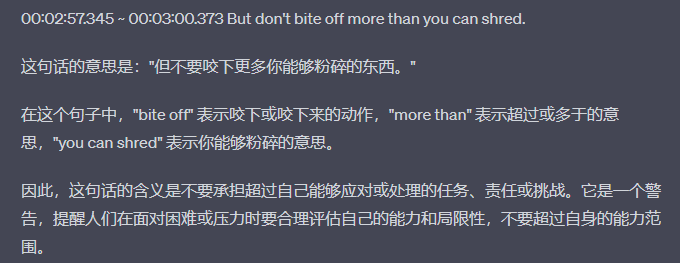
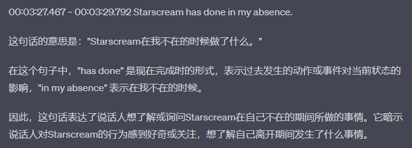
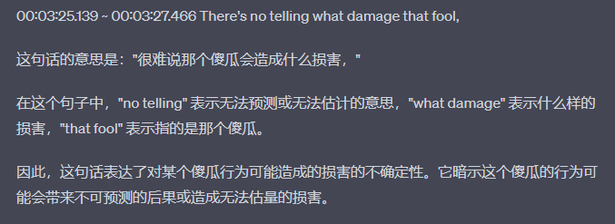

## have(got) somebody covered

**: **==to have done, gotten, or provided whatever is needed ==**: **==take care of everything==

Don't worry about a thing. We*'ve got you covered*.

You don't need to buy soda for the party. We*'ve* already *got that covered*.

## bite off

## turn out to be

## in my absence

## no telling

